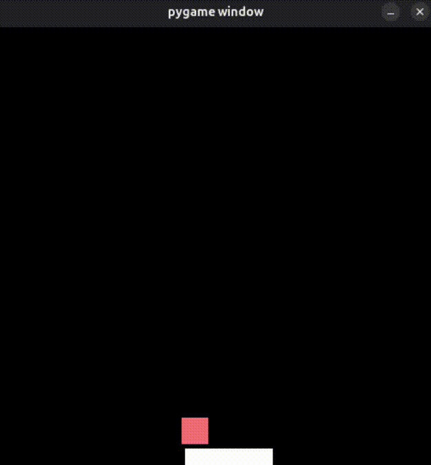
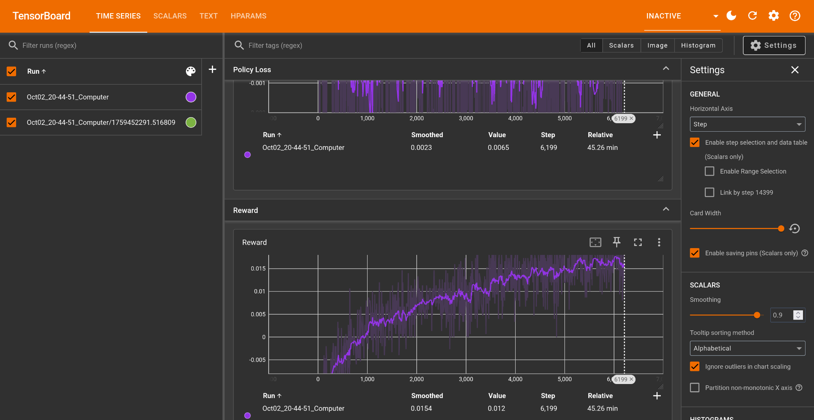

# Proximal Policy Optimization from scratch

This repo demonstrates the Proximal Policy Optimization algorithm as described in the [Proximal Policy Optimization](https://arxiv.org/pdf/1707.06347) paper. 

The [PPO_From_Scratch.ipynb](PPO_From_Scratch.ipynb) notebook demonstrates all of the neccessary steps in the algorithm, highlighting their derivations from the paper. The notebook uses the Python Learning Environment as the framework for demonstrating the training. 

The [Watch_Live_Training.ipynb](Watch_Live_Training.ipynb) notebook allows the user to see the realtime progress of the ongoing training. 

## Getting Started

### Prerequisites
- Python >= 3.10
- git

### Setup
1. Open a terminal and clone the repo to your local environment
```bash
git clone https://github.com/dj65/reinforcement-learning.git
```

2. Change Directory to repo root folder

```bash
cd reinforcement-learning
```

3. Execute the `make` script to download and install all dependencies, and launch Jupyter Notebooks:

```bash
make
```
4. After executing all of the steps above you will have access to the Notebooks for training a model and watching the model play the games.

<hr/>

Here Catcher is being played by a model that was trained using the [PPO_From_Scratch.ipynb](PPO_From_Scratch.ipynb) notebook.



<hr/>

Here Tensorboard is showing how the Rewards cross from negative to positive over it's training.



<hr/>

Here Flappy Bird is being played by a model that was trained using the [PPO_From_Scratch.ipynb](PPO_From_Scratch.ipynb) notebook.


